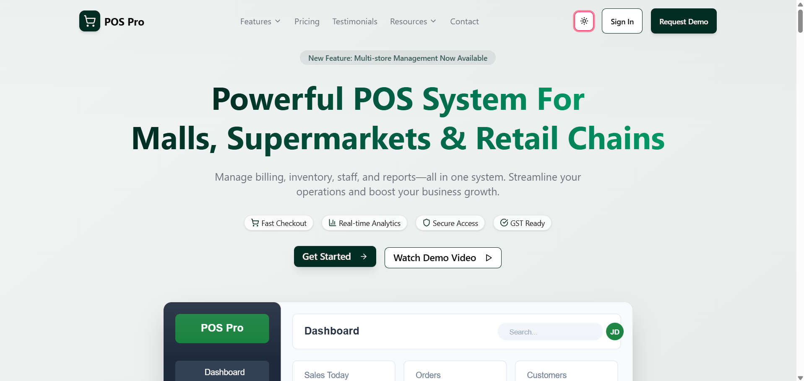
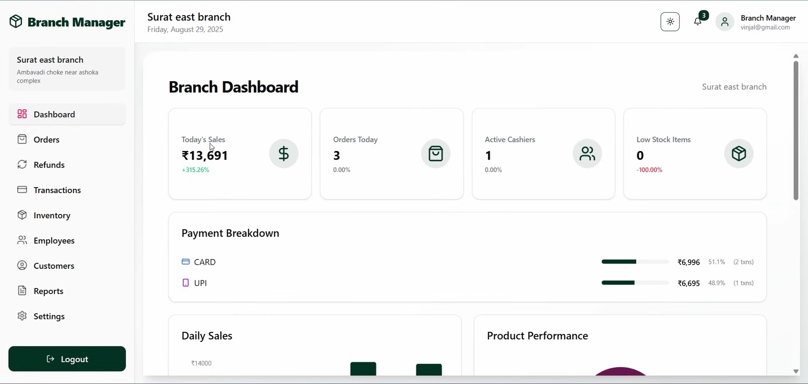
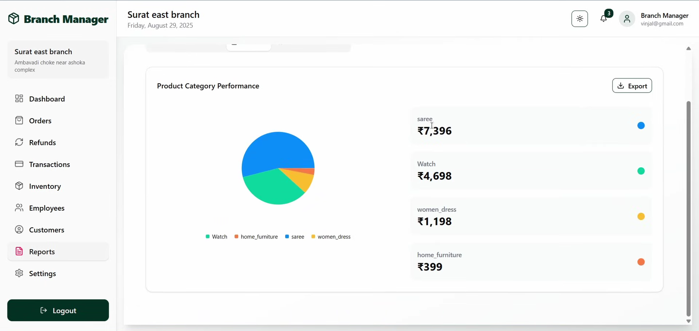

# 🛒 POS Pro — Enterprise Multi-Tenant SaaS Point-of-Sale System

<p align="center">
  
</p>

<p align="center">
  <a href="https://spring.io/projects/spring-boot"></a>
  <a href="https://reactjs.org/"></a>
  <a href="https://www.oracle.com/java/"></a>
  <a href="https://www.mysql.com/"></a>
  <a href="https://redux-toolkit.js.org/"></a>
  <a href="https://ui.shadcn.com/"></a>
  <a href="LICENSE"></a>
</p>

<p align="center">
  <strong>A production-ready, enterprise-grade Point-of-Sale system built for malls, supermarkets, and retail chains.</strong><br/>
  Multi-tenant architecture • Real-time analytics • Dual payment gateway integration • Role-based access control
</p>

---

> **📊 Project Metrics:** 12 REST Controllers • 13 JPA Entities • 22 Redux Slices • 48 UI Components • 6 User Roles

---

## 📋 Table of Contents

- [Overview](#-overview)
- [Key Features](#-key-features)
- [System Architecture](#-system-architecture)
- [Tech Stack](#-tech-stack)
- [Getting Started](#-getting-started)
- [API Documentation](#-api-documentation)
- [User Roles](#-user-roles)
- [Payment Integration](#-payment-integration)
- [Security](#-security)
- [Deployment](#-deployment)
- [Screenshots](#-screenshots)
- [Contributing](#-contributing)
- [License](#-license)

---

## 🌟 Overview

This **Multi-Tenant SaaS POS System** is an enterprise-ready solution for retail businesses of all sizes. It supports multiple stores, branches, and employees with role-based access control, real-time inventory management, comprehensive analytics, and seamless payment processing.

### Why This POS System?

| Feature | Implementation |
|---------|----------------|
| 🏢 **Multi-Tenant Architecture** | Complete data isolation per store with hierarchical Store → Branch → Employee structure |
| 👥 **Role-Based Access Control** | 6 distinct user roles with granular permissions across 5 custom dashboards |
| 📊 **Real-Time Analytics** | Branch & store-level insights with Recharts visualization (sales trends, top products, cashier performance) |
| 💳 **Dual Payment Gateway** | Razorpay (India) + Stripe (Global) with webhook-based subscription management |
| 🔐 **Enterprise Security** | JWT authentication (24h expiry), BCrypt encryption, stateless session management |
| 🛒 **Complete POS Workflow** | Order processing, inventory tracking, shift management, refund handling, PDF receipts |
| 📦 **48 Reusable Components** | Built with shadcn/ui (New York theme) + Radix UI primitives for consistent UX |

---

## 🚀 Key Features

### 🏪 Store Management
- **Multi-Store Support**: Manage multiple stores from a single platform
- **Branch Management**: Hierarchical store → branch → employee structure
- **Store Admin Dashboard**: Comprehensive analytics and controls
- **Store Status Management**: Active, pending, blocked states

### 📦 Inventory Management
- **Real-Time Stock Tracking**: Branch-wise inventory management
- **Low Stock Alerts**: Automated notifications for minimum stock levels
- **Product Catalog**: Categories, SKUs, pricing, and images
- **Bulk Operations**: Import/export product data

### 🛒 Point-of-Sale
- **Fast Checkout**: Streamlined order processing interface
- **Multiple Payment Methods**: Cash, Card, UPI support
- **Customer Management**: Order history and customer profiles
- **Discount & Promotions**: Flexible discount application
- **Receipt Generation**: Digital and print receipts

### 💰 Financial Management
- **Shift Reports**: Cashier shift tracking and reconciliation
- **Payment Reconciliation**: Cash, card, UPI breakdown
- **Refund Processing**: Complete refund management
- **Sales Analytics**: Daily, weekly, monthly sales reports

### 📊 Advanced Analytics
- **Store-Level Analytics**:
  - Sales trends and forecasting
  - Branch performance comparison
  - Category-wise sales insights
  - Payment method distribution

- **Branch-Level Analytics**:
  - Daily sales tracking
  - Top-selling products
  - Cashier performance metrics
  - Category sales breakdown

- **Admin Dashboard**:
  - System-wide statistics
  - Store registration trends
  - Store status distribution
  - Platform health monitoring

### 👥 User Management
- **7 User Roles**: 
  - Super Admin
  - Store Admin
  - Store Manager
  - Branch Manager
  - Branch Admin
  - Branch Cashier
  - Customer

- **Role-Based Access Control**: Granular permissions per role
- **Employee Management**: Assign employees to stores/branches
- **Authentication**: JWT-based stateless authentication
- **Password Reset**: Email-based password recovery

### 💳 Subscription & Billing
- **Subscription Plans**: Multiple tiers with feature restrictions
- **Billing Cycles**: Monthly and yearly options
- **Payment Integration**: Razorpay and Stripe gateways
- **Auto-Renewal**: Automated subscription management
- **Trial Periods**: Configurable trial durations

---

## 🏗️ System Architecture

```
┌─────────────────────────────────────────────────────────┐
│                    Frontend Layer                        │
│           React 19 + Vite + TailwindCSS                 │
│        Redux Toolkit + React Router + Axios             │
└───────────────────┬─────────────────────────────────────┘
                    │ REST API (JSON)
┌───────────────────▼─────────────────────────────────────┐
│                   Backend Layer                          │
│           Spring Boot 3.5.8 REST API                    │
│              JWT Authentication                          │
└───────────────────┬─────────────────────────────────────┘
                    │
      ┌─────────────┼─────────────┐
      │             │             │
┌─────▼─────┐ ┌────▼─────┐ ┌─────▼──────┐
│  MySQL    │ │ Razorpay │ │   Stripe   │
│ Database  │ │ Gateway  │ │   Gateway  │
└───────────┘ └──────────┘ └────────────┘
```

### Layered Architecture

```
┌──────────────────────────────────────┐
│     Presentation Layer (19 REST      │
│         Controllers + DTOs)          │
└─────────────┬────────────────────────┘
              │
┌─────────────▼────────────────────────┐
│      Service Layer (13 Services)     │
│     Business Logic & Validation      │
└─────────────┬────────────────────────┘
              │
┌─────────────▼────────────────────────┐
│   Persistence Layer (15 Entities)    │
│      JPA Repositories + MySQL        │
└──────────────────────────────────────┘
```

---

## 🛠️ Tech Stack

### Backend
- **Framework**: Spring Boot 3.5.8
- **Language**: Java 17 (LTS)
- **Database**: MySQL 8.0
- **ORM**: Spring Data JPA + Hibernate
- **Security**: Spring Security 6 + JWT (JJWT 0.12.6)
- **Build Tool**: Maven 3.8+
- **Payment SDKs**: Razorpay Java SDK 1.4.8, Stripe Java SDK 28.3.1
- **Email**: Spring Mail (SMTP)
- **Validation**: Jakarta Bean Validation
- **Utilities**: Lombok, MapStruct-style Mappers

### Frontend
- **Framework**: React 19.1.0
- **Build Tool**: Vite 7.0.0
- **UI Library**: shadcn/ui (New York theme) + Radix UI Primitives
- **Styling**: TailwindCSS 4.1.11
- **State Management**: Redux Toolkit 2.8.2 (22 feature slices)
- **Routing**: React Router 7.6.3
- **HTTP Client**: Axios 1.10.0
- **Forms**: React Hook Form + Zod/Yup Validation
- **Charts**: Recharts 3.1.0
- **PDF Generation**: @react-pdf/renderer 4.3.0
- **Notifications**: Sonner 2.0.5
- **Icons**: Lucide React

### DevOps & Tools
- **Containerization**: Docker + Jib Maven Plugin
- **Development**: Spring Boot DevTools, Hot Module Replacement (HMR)
- **Code Quality**: ESLint, Spring Boot Actuator

---

## 🚦 Getting Started

### Prerequisites

- **Java 17** or higher
- **Node.js 18+** and **pnpm** (or npm)
- **MySQL 8.0** or higher
- **Maven 3.8+**
- **Git**

### Backend Setup

1. **Clone the repository**
   ```bash
   git clone <repository-url>
   cd pos-application/pos-backend
   ```

2. **Configure Database**
   
   Create a MySQL database:
   ```sql
   CREATE DATABASE pos CHARACTER SET utf8mb4 COLLATE utf8mb4_unicode_ci;
   ```

3. **Set Environment Variables**
   
   Create `application.yml` or set environment variables:
   ```yaml
   # Database
   DB_USERNAME=your_db_username
   DB_PASSWORD=your_db_password
   
   # JWT Secret (256-bit key)
   JWT_SECRET=your-secure-jwt-secret-key-here
   
   # Email Configuration
   MAIL_USERNAME=your-email@gmail.com
   MAIL_APP_PASSWORD=your-app-specific-password
   
   # Razorpay
   RAZORPAY_KEY_ID=rzp_test_xxxxx
   RAZORPAY_KEY_SECRET=your_razorpay_secret
   
   # Stripe
   STRIPE_API_KEY=sk_test_xxxxx
   ```

4. **Build and Run**
   ```bash
   # Install dependencies and build
   ./mvnw clean install
   
   # Run the application
   ./mvnw spring-boot:run
   ```
   
   The backend will start on `http://localhost:5000`

### Frontend Setup

1. **Navigate to frontend directory**
   ```bash
   cd pos-application/pos-frontend
   ```

2. **Install dependencies**
   ```bash
   pnpm install
   # or
   npm install
   ```

3. **Configure API endpoint**
   
   Update the API base URL in your configuration file (typically in `src/utils/api.js` or environment variables)

4. **Run development server**
   ```bash
   pnpm dev
   # or
   npm run dev
   ```
   
   The frontend will start on `http://localhost:5173`

### Docker Setup (Optional)

1. **Build backend Docker image**
   ```bash
   cd pos-backend
   ./mvnw clean package
   docker build -t pos-backend:latest .
   ```

2. **Run with Docker Compose**
   ```bash
   docker-compose up -d
   ```

---

## 📚 API Documentation

### Base URL
```
http://localhost:5000
```

### Authentication

#### Register User
```http
POST /auth/signup
Content-Type: application/json

{
  "email": "user@example.com",
  "password": "securePassword123",
  "fullName": "John Doe",
  "role": "ROLE_BRANCH_CASHIER"
}
```

#### Login
```http
POST /auth/login
Content-Type: application/json

{
  "email": "user@example.com",
  "password": "securePassword123"
}

Response:
{
  "jwt": "eyJhbGciOiJIUzI1NiIsInR5cCI6IkpXVCJ9...",
  "message": "Login successful",
  "role": "ROLE_BRANCH_CASHIER"
}
```

#### Password Reset
```http
POST /auth/forgot-password
Content-Type: application/json

{
  "email": "user@example.com"
}
```

```http
POST /auth/reset-password
Content-Type: application/json

{
  "token": "reset-token-from-email",
  "newPassword": "newSecurePassword123"
}
```

### Core APIs

#### Create Order
```http
POST /api/orders
Authorization: Bearer <JWT_TOKEN>
Content-Type: application/json

{
  "customerId": 1,
  "orderItems": [
    {
      "productId": 101,
      "quantity": 2,
      "unitPrice": 50.00
    }
  ],
  "paymentType": "CARD",
  "discount": 5.00
}
```

#### Get Branch Inventory
```http
GET /api/inventories/branch/{branchId}
Authorization: Bearer <JWT_TOKEN>
```

#### Create Product
```http
POST /api/products
Authorization: Bearer <JWT_TOKEN>
Content-Type: application/json

{
  "name": "Product Name",
  "sku": "SKU12345",
  "price": 99.99,
  "categoryId": 5,
  "storeId": 1,
  "description": "Product description",
  "image": "https://example.com/image.jpg"
}
```

#### Branch Analytics Overview
```http
GET /api/branch/analytics/{branchId}/overview
Authorization: Bearer <JWT_TOKEN>
```

For complete API documentation, refer to `pos-backend/LOW_LEVEL_DESIGN.md`

---

## 👥 User Roles

| Role | Capabilities |
|------|-------------|
| **ADMIN** | Full system access, store management, platform analytics |
| **STORE_ADMIN** | Manage store, branches, employees, view store analytics |
| **STORE_MANAGER** | Oversee store operations, branch coordination |
| **BRANCH_MANAGER** | Manage branch, employees, inventory, view analytics |
| **BRANCH_ADMIN** | Branch administration, employee management |
| **BRANCH_CASHIER** | Process orders, manage shifts, handle refunds |
| **CUSTOMER** | View order history, account management |

---

## 💳 Payment Integration

### Supported Gateways

#### Razorpay
- **Currencies**: INR
- **Methods**: Cards, UPI, NetBanking, Wallets
- **Features**: Instant settlements, refunds, webhooks

#### Stripe
- **Currencies**: 135+ currencies
- **Methods**: Cards, digital wallets
- **Features**: International payments, strong SCA

### Payment Flow

```
1. User selects subscription plan
2. Backend creates payment order (Razorpay/Stripe)
3. Frontend redirects to payment gateway
4. User completes payment
5. Gateway webhook triggers subscription activation
6. User receives confirmation email
```

---

## 🔒 Security

### Authentication & Authorization
- **JWT Tokens**: 24-hour expiration, stateless authentication
- **BCrypt**: Password hashing with 10 rounds
- **Role-Based Access Control (RBAC)**: Granular permissions

### API Security
- **CORS**: Configured for specific origins
- **HTTPS**: SSL/TLS encryption (in production)
- **Input Validation**: Bean Validation API
- **SQL Injection**: Prevented via JPA PreparedStatements
- **XSS Protection**: JSON serialization, content security

### Data Protection
- **Multi-Tenancy Isolation**: Row-level security via store/branch IDs
- **Password Reset**: Time-limited tokens (1 hour expiry)
- **Session Management**: Stateless design, no server-side sessions

---

## 🚀 Deployment

### Production Checklist

- [ ] Set strong JWT secret key (256-bit)
- [ ] Configure production database credentials
- [ ] Enable HTTPS with SSL certificate
- [ ] Set up email SMTP for production
- [ ] Configure payment gateway production keys
- [ ] Set appropriate CORS origins
- [ ] Enable database connection pooling
- [ ] Configure logging levels
- [ ] Set up monitoring and alerts
- [ ] Implement database backups
- [ ] Configure CDN for frontend assets

### Docker Deployment

```bash
# Build images
docker-compose -f docker-compose.prod.yml build

# Start services
docker-compose -f docker-compose.prod.yml up -d

# View logs
docker-compose logs -f backend
```

### Cloud Deployment Options

- **Backend**: AWS EC2, Heroku, Google Cloud Run, Azure App Service
- **Frontend**: Vercel, Netlify, AWS S3 + CloudFront
- **Database**: AWS RDS, Google Cloud SQL, Azure Database for MySQL
- **Container**: AWS ECS, Google Kubernetes Engine, Azure AKS

---

## 📸 Screenshots

### 🏠 Landing Page
<p align="center">
  
</p>

### 📊 Branch Dashboard
<p align="center">
  
</p>

### 📈 Analytics & Reports
<p align="center">
  
</p>

---

## 👥 Team
| Contributor | Role |
|-------------|------|
| **[@Ankur071](https://github.com/Ankur071)** | Full-Stack Developer |
| **[@RishabhK488](https://github.com/RishabhK488)** | Frontend Developer |

---

## 🏗️ Project Structure

```
pos-system/
├── pos-backend/                 # Spring Boot Backend
│   ├── src/
│   │   ├── main/
│   │   │   ├── java/com/zosh/
│   │   │   │   ├── config/            # Security, JWT, Email
│   │   │   │   ├── controller/        # 19 REST Controllers
│   │   │   │   ├── service/           # Business Logic
│   │   │   │   ├── repository/        # JPA Repositories
│   │   │   │   ├── model/             # 18 Entity Models
│   │   │   │   ├── payload/           # DTOs
│   │   │   │   ├── response/          # API Responses
│   │   │   │   ├── exception/         # Error Handling
│   │   │   │   └── util/              # Utility Classes
│   │   │   └── resources/
│   │   │       └── application.yml    # Configuration
│   │   └── test/                      # Unit Tests
│   ├── pom.xml                        # Maven Dependencies
│   └── LOW_LEVEL_DESIGN.md           # Detailed Design Doc
│
└── pos-frontend/                # React Frontend
    ├── src/
    │   ├── components/          # Reusable UI Components
    │   ├── pages/               # Page Components
    │   ├── context/             # React Context
    │   ├── hooks/               # Custom Hooks
    │   ├── routes/              # Routing Configuration
    │   ├── Redux Toolkit/       # State Management
    │   └── utils/               # Utility Functions
    ├── package.json
    └── vite.config.js
```

---

## 🤝 Contributing

Contributions are welcome! Please follow these steps:

1. **Fork the repository**
2. **Create a feature branch**
   ```bash
   git checkout -b feature/AmazingFeature
   ```
3. **Commit your changes**
   ```bash
   git commit -m 'Add some AmazingFeature'
   ```
4. **Push to the branch**
   ```bash
   git push origin feature/AmazingFeature
   ```
5. **Open a Pull Request**

### Development Guidelines

- Follow existing code style and patterns
- Write meaningful commit messages
- Add tests for new features
- Update documentation as needed
- Ensure all tests pass before submitting PR

---

## 📄 License

This project is licensed under the MIT License - see the [LICENSE](LICENSE) file for details.

---

## 🙏 Acknowledgments

- **Spring Boot** - Powerful Java framework
- **React** - Modern UI library
- **Radix UI** - Accessible component primitives
- **TailwindCSS** - Utility-first CSS framework
- **Razorpay & Stripe** - Payment gateway integrations

---

## 📞 Support

For questions, feedback, or collaboration:
- 🐛 **Issues**: Open an issue on this repository
- 💼 **LinkedIn**: Connect with the contributors listed above
- ⭐ **Star this repo** if you find it useful!

---

## 🗺️ Planned Enhancements

### ✅ Completed
- Multi-tenant SaaS architecture with store/branch hierarchy
- Complete POS workflow (orders, refunds, shift management)
- Real-time inventory tracking per branch
- Analytics dashboards with data visualization
- Dual payment gateway integration (Razorpay + Stripe)
- Role-based access control (6 user roles)
- Subscription management system

### 🔜 Upcoming Features
| Feature | Description | Priority |
|---------|-------------|----------|
| 📱 Mobile App | React Native app for cashiers and managers | High |
| 📴 Offline Mode | Local-first POS with sync capabilities | High |
| 🔖 Barcode Scanner | Hardware integration for faster checkout | Medium |
| 🎁 Loyalty Program | Customer rewards and points system | Medium |
| 🌍 Multi-Currency | International store support | Low |
| 🤖 AI Forecasting | Demand prediction and stock optimization | Low |

---

<div align="center">

**Built with Spring Boot & React**

⭐ If this project helped you, consider giving it a star!

</div>
